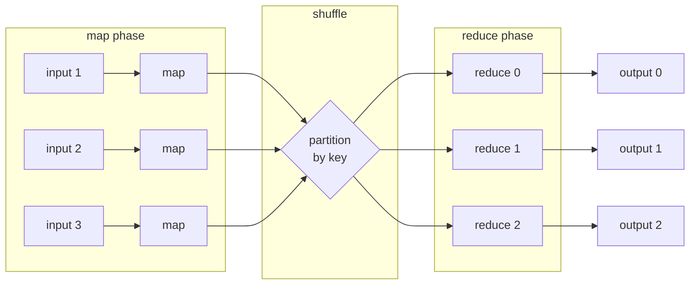
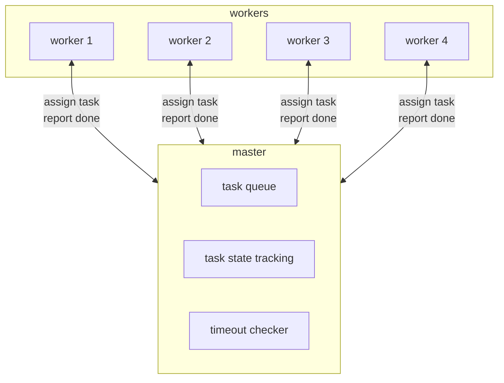
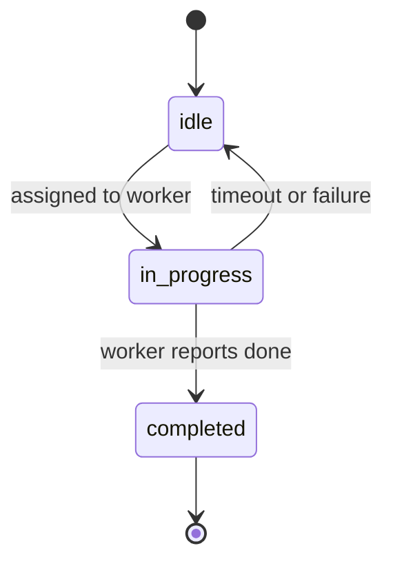
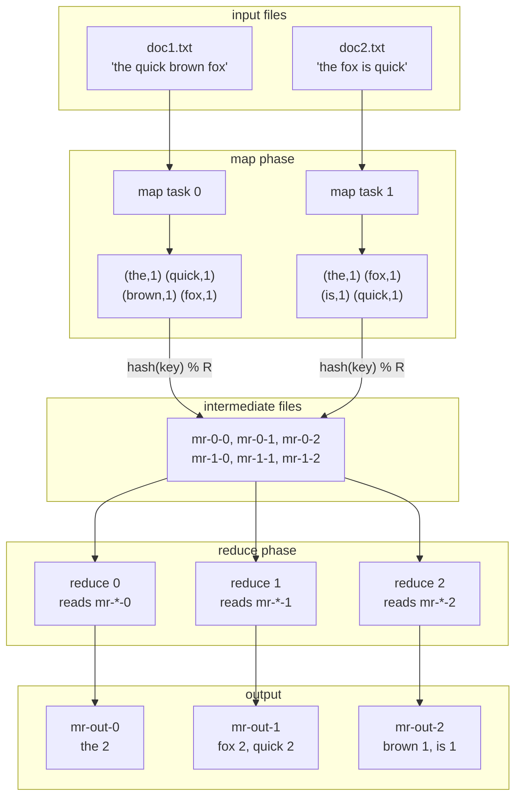
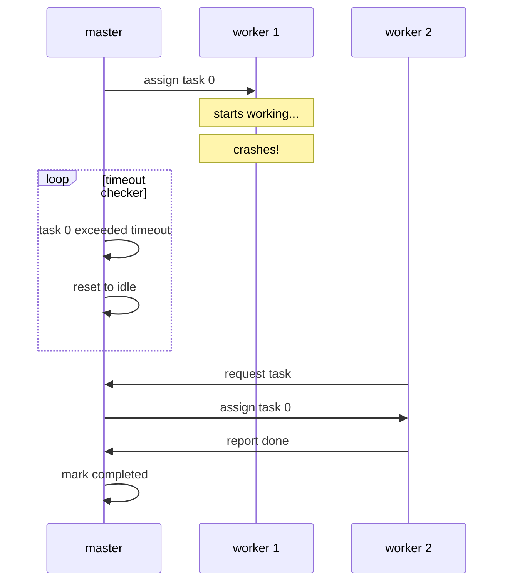

# mprdc

a simple mapreduce implementation in go, built for learning.

based on the [google mapreduce paper](https://research.google/pubs/pub62/) by jeffrey dean and sanjay ghemawat (2004).

## what is mapreduce?

mapreduce is a programming model for processing large datasets in parallel across a cluster. the idea is simple:

1. **map**: transform input data into key-value pairs
2. **shuffle**: group all values by key
3. **reduce**: combine values for each key into a final result



## architecture

the system uses a master-worker pattern:



- **master**: holds all tasks, assigns them to workers, tracks state
- **workers**: request tasks, execute map/reduce, report completion

## task lifecycle

each task goes through these states:



## data flow (word count example)



## intermediate file naming

the key insight is how intermediate files are organized:

```
         reduce partitions
              0   1   2
           ┌───┬───┬───┐
map task 0 │0-0│0-1│0-2│  ← map writes ROWS
map task 1 │1-0│1-1│1-2│
map task 2 │2-0│2-1│2-2│
           └───┴───┴───┘
             ↓   ↓   ↓
           reduce reads COLUMNS
```

- map task `m` writes to `mr-m-0`, `mr-m-1`, `mr-m-2` (one per partition)
- reduce task `r` reads `mr-0-r`, `mr-1-r`, `mr-2-r` (from all map tasks)

## features implemented

### from the paper

| feature | status | description |
|---------|--------|-------------|
| map/reduce | ✅ | core paradigm |
| partitioning | ✅ | `hash(key) % nReduce` |
| master-worker | ✅ | coordinator pattern |
| task timeouts | ✅ | detect crashed workers |
| task retry | ✅ | reschedule failed tasks |
| file splitting | ✅ | large files → multiple map tasks |

### additional

| feature | description |
|---------|-------------|
| exponential backoff | failed tasks wait before retry (1s → 2s → 4s...) |
| jitter | randomized delays to prevent thundering herd |
| line alignment | chunks don't split words/lines |

## fault tolerance



## usage

```go
// define your map function
mapF := func(content string) []KeyValue[string, string] {
    words := strings.Fields(content)
    kvs := make([]KeyValue[string, string], 0, len(words))
    for _, word := range words {
        kvs = append(kvs, KeyValue[string, string]{
            Key:   strings.ToLower(word),
            Value: "1",
        })
    }
    return kvs
}

// define your reduce function
reduceF := func(key string, values []string) string {
    return strconv.Itoa(len(values))
}

// run mapreduce
files := []string{"data/doc1.txt", "data/doc2.txt"}
results := RunMapReduce(files, 3, 4, mapF, reduceF)
//                      ↑      ↑  ↑
//                      │      │  └── 4 workers
//                      │      └───── 3 reduce partitions
//                      └──────────── input files
```

## run

```bash
go run .
```

output:
```
Word counts:
  the: 5
  fox: 2
  quick: 2
  ...
```

## project structure

```
mprdc/
├── main.go      # orchestration, word count example
├── master.go    # task assignment, timeout detection, backoff
├── worker.go    # map/reduce execution, file i/o
├── types.go     # Task, KeyValue, MapFunc, ReduceFunc
└── README.md
```

## references

- [mapreduce: simplified data processing on large clusters](https://research.google/pubs/pub62/) - the original paper
- [mit 6.824](https://pdos.csail.mit.edu/6.824/) - distributed systems course with mapreduce lab
